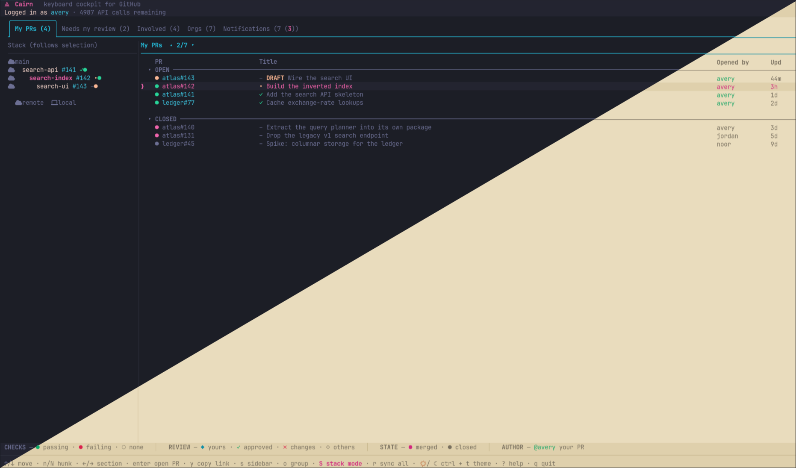
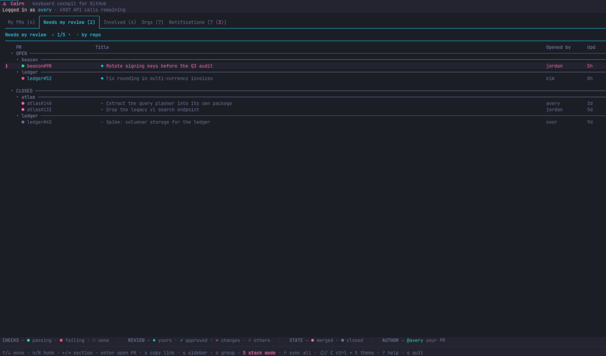
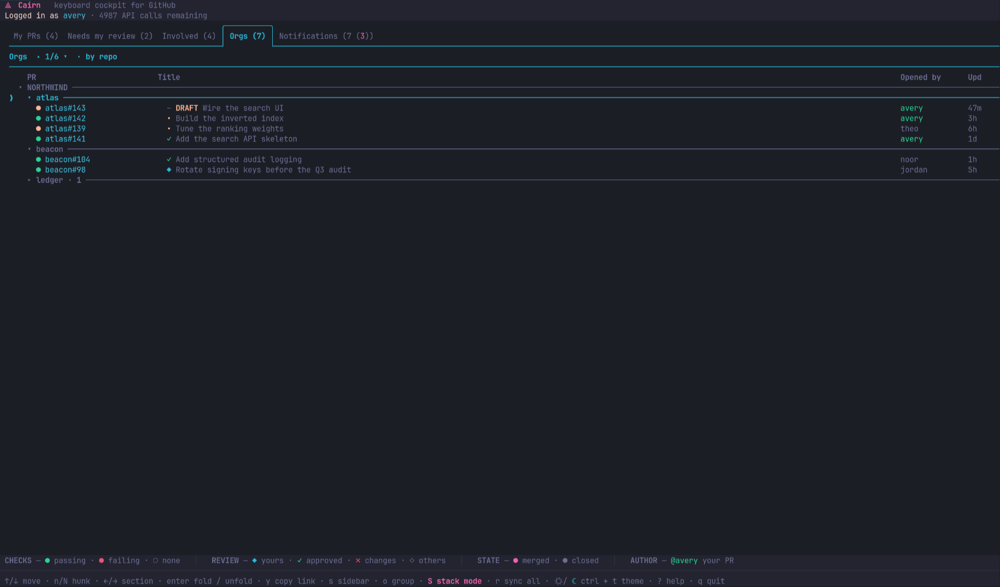
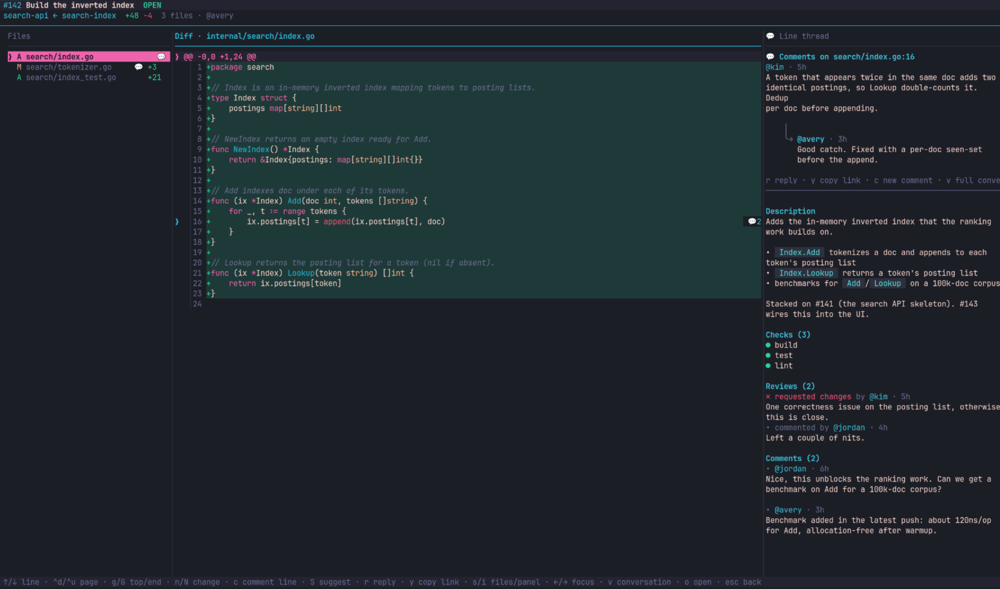
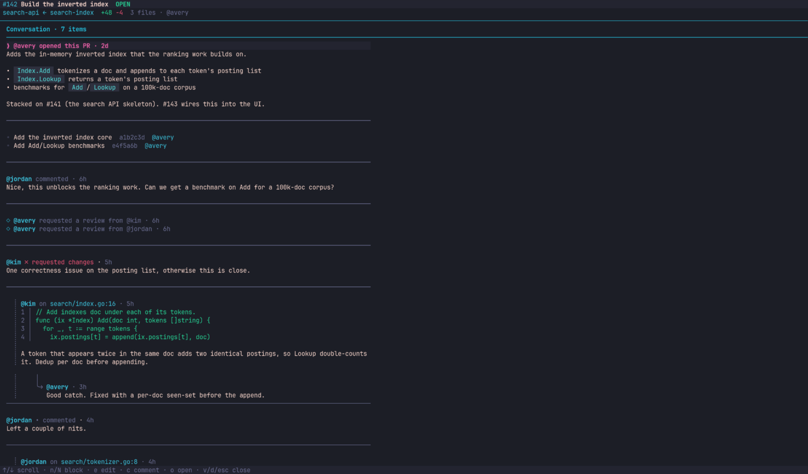
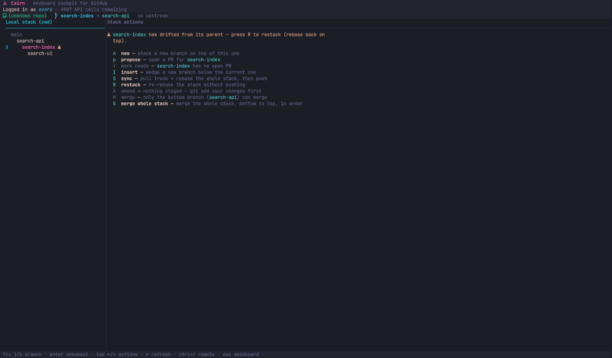
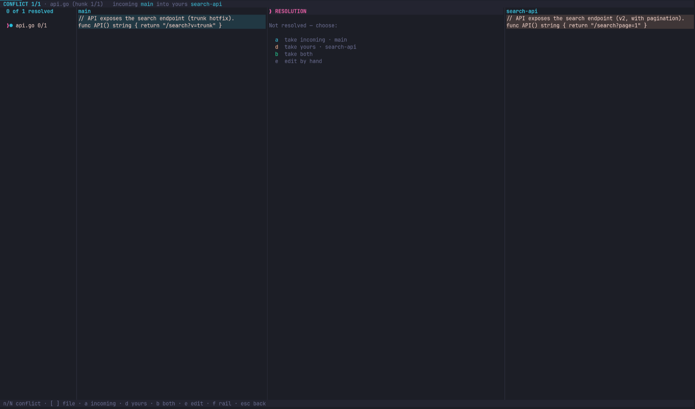
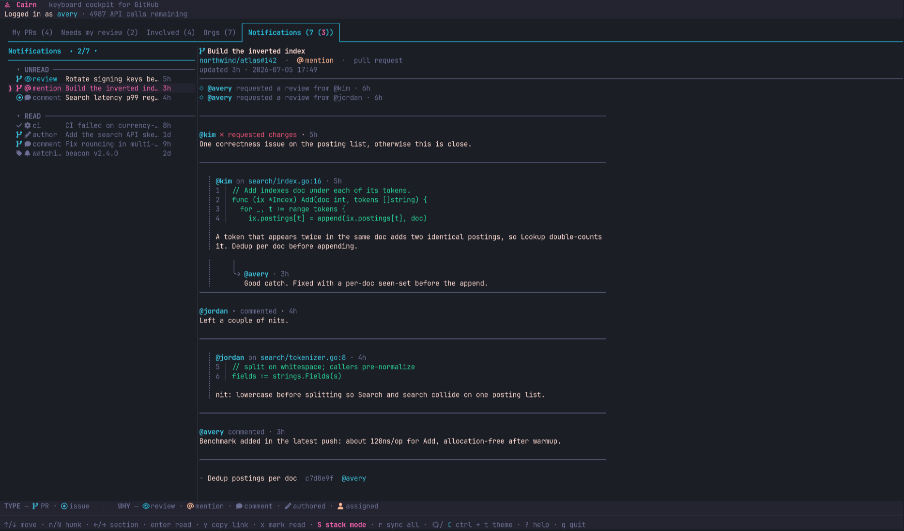

<div align="center">

# &nbsp; Cairn

**A terminal cockpit for GitHub.** Your PR board, your code review, and your stacked-PR workflow, in one keyboard-driven TUI that never leaves the terminal.

*gh-dash's board × GitHub Desktop's friendliness × git-town's branch engine, with first-class PR stacking, running fully local.*

</div>



---

## What's a cairn?

A cairn is a stack of balanced stones hikers build to mark a trail. The name does triple duty here, which is exactly why it stuck:

- a **stack** (the core feature: stacked pull requests),
- a **waypoint you navigate by** (the cockpit: your whole GitHub day at a glance),
- and stone-balancing as a **mindful** practice.

The stack view draws the whole chain as a tree, one pull request per stone, so the shape of your work is always in front of you. Build your stack, ship it, move on. No stones were harmed.

## Why Cairn exists

Be honest about your current setup: one browser tab for the PR board, one for the diff you're reviewing, three for the stack you're trying to land in the right order, one for the notifications you refresh out of pure anxiety, and a terminal where you're about to type a `git rebase` you'll regret. That's not a workflow, that's a hostage situation.

Cairn folds all of it into a single binary you drive from the keyboard. Three things it does that a plain dashboard does not:

1. **A live stack tree.** A visual graph of your stacked branches, each with its PR number, review state, and a CI dot. Nobody else draws you the stack. You've been keeping it in your head, and your head has other jobs.
2. **Review in the pane.** Read the diff, drop inline comments and suggestions, reply to threads, approve or request changes, all without opening github.com and losing forty minutes to "just checking one thing."
3. **Ship the stack.** Merge a reviewed stack bottom-up, retargeting every base along the way, no web app required.

And it stays out of your way: any subcommand Cairn doesn't recognize falls straight through to `git`, so `cairn status` is just `git status`. Your muscle memory keeps its job.

---

## Features, the full tour

### 🗂️ The board — your whole GitHub in tabs

Configurable sections, each backed by a GitHub search filter, rendered as a fast scrollable list. Out of the box you get:

- **My PRs** — everything you have open.
- **Needs my review** — where you're on the hook.
- **Involved** — anything you've touched.
- **Orgs** — an org-wide view across your teams.
- **Notifications** — your inbox, right here (more below).

Cycle tabs with `tab` / `shift-tab`, jump between headers with `n` / `N`, group by repo with `o`, refresh every tab at once with `r`. Recently merged and closed PRs settle into a muted tail under the open ones, so you can see what just landed without playing detective.





### 🔍 Review, without the round trip

Select a PR and the center pane opens the diff: syntax-highlighted, with a file tree and hunk navigation. From here you can:

- **Comment inline** on any diff line (`c`), exactly like GitHub's "add single comment".
- Leave **suggestions** that the author can apply with one click.
- **Reply** into an existing inline thread, so the conversation stays threaded instead of scattered across the PR like confetti.
- **Approve** (`a`) or **request changes** (`x`).
- **Edit your own** comments and reviews in place, for when you approve first and read the diff second.
- Copy any comment or PR link to the clipboard (`y`), or open the PR in your browser (`o`) as an escape hatch.

The right pane carries the conversation, the checks list, and the CI rollup, so you're reading state and history side by side with the code.



Need the whole discussion instead of the diff? Press **`v`** for the full-page **conversation view**: the entire threaded timeline in one column — description, comments, reviews, inline threads (with their `╰→` reply guides), commits and events interleaved in order. Walk it block by block with `n` / `N`, reply with `r`, edit your own with `e`, and `v` again drops you back to the diff.



### ⛰️ The stack — stacked PRs that actually stay stacked

GitHub has no idea what a stack is. A stack is a chain of branches where each PR targets the one *below* it instead of `main`, and keeping that chain rebased and true by hand is the kind of task that turns a Tuesday into a `git reflog` archaeology dig. So Cairn doesn't reinvent it: it drives a proven branch engine under the hood for every mutation, and reads the lineage straight from your git config to draw the tree.

Press `s` to peek at the **stack sidebar** next to the board; it follows whatever PR you have selected and reconstructs the stack from the PR base/head chain, even for repos you haven't checked out. A cloud icon marks remote-reconstructed nodes; a laptop icon marks branches git-town is tracking locally.

Press `S` to drop into **stack mode**, a dedicated cockpit for authoring and maintaining the current repo's stack. Every command is one key, every confirmation explains exactly what's about to happen (no "are you sure?" with zero context), and the run log streams the output live:

| Key | Command | What it does |
|-----|---------|--------------|
| `n` | **new** | Stack a new branch as a child of the current one. |
| `I` | **insert** | Wedge a new empty branch *underneath* the current one, for when you realize a lower change was missing all along. |
| `p` | **propose** | Open a PR, base set automatically from the lineage (so it never accidentally targets `main` and asks your team to review 4,000 lines), title and body in a Markdown composer with live preview and a draft toggle. |
| `Y` | **mark ready** | Take a draft PR out of draft, mid-stack, without checking it out. |
| `A` | **amend** | Fold staged changes into this branch, then restack everything above it. |
| `S` | **sync** | Pull trunk, rebase the whole stack, prune merged branches, push. |
| `R` | **restack** | Same rebase, no push, for clearing drift before you're ready to publish. |
| `M` | **merge (ship)** | Merge the bottom PR, delete the branch, re-parent the rest onto trunk. |
| `G` | **merge whole stack** | Land the entire stack bottom-to-top in one go, retargeting each base as it goes. |

> **Under the hood:** every stack command is built on [git-town](https://www.git-town.com). Cairn issues the intent and shows you the result; git-town does the rebase math it's very good at. There is no hand-rolled `git rebase` anywhere in Cairn, on purpose, because that's how you end up on the archaeology dig.



### 🚢 Ship it — one PR or the whole stack

Merging a stack by hand is the classic footgun: merge the bottom, then sprint to retarget every PR above it before a teammate's merge reshuffles the bases and one of your PRs quietly decides its new base is a branch that no longer exists. Cairn does the sprinting for you.

- **`M`** lands just the bottom PR (squash), deletes the branch, and syncs so the rest re-parents onto trunk.
- **`G`** lands the *whole* stack bottom-up: squash-merge each PR, retarget the branch above onto trunk (via the REST API), delete the merged branch, and sync once at the end.

Both are gated: Cairn refuses to ship a PR that isn't mergeable, and tells you why rather than making you guess. If a PR partway up the stack can't land, the ones below it still merge and everything above is left untouched, so you're never stranded in a half-broken state you can't reason about at 5:55 on a Friday.

### 📡 Remote stack mode — land a stack you never checked out

Hit `ctrl+r` in stack mode to operate on a repo you don't have cloned locally. Cairn reconstructs the stack purely from the PRs' base/head chains and ships it through the GitHub API alone, no local checkout, no `git clone`, no waiting for `node_modules` to think about its life. Perfect for landing a teammate's approved stack from wherever you happen to be sitting.

### 🌊 Drift detection & one-key reconcile

Ran raw git behind Cairn's back? Merged a PR from the web UI in a moment of weakness? Your local lineage is now a beautiful work of fiction. Cairn notices: a drifted node turns **amber** with a `⚠`, and a branch that landed or closed on the remote gets flagged too. Instead of nagging you to figure out the fix, Cairn funnels the whole pane to a single move: press **`X`** to reconcile, and your local copy snaps back in step with the remote.

### 🧩 Conflict resolver

When a `sync` or `restack` hits a merge conflict, you don't get dumped into a bare `git mergetool` and left to bond with vim over the experience. Cairn opens an approachable, file-by-file resolver borrowed from GitHub Desktop's model: take the incoming side, take yours, take both, or edit by hand, then continue, all inside the TUI.



### 📨 Notifications inbox

The Notifications tab is a two-pane inbox: the list on the left, a live conversation preview on the right. Focus the preview with `→` or `enter`, scroll the thread, mark items read with `x`, and yank a link with `y`. It's the part of github.com you compulsively refresh, brought into the terminal so you can compulsively refresh it without breaking flow.



### 🎨 Theming

Cairn ships with a dark theme and a light variant for daylight, and every color token is overridable in your config. The palette is built around three unmistakable jobs: blue carries the structure (borders, headers, where you are), pink marks the selected row and the active stone, and coral means failure. Three jobs, three colors, no squinting.

### ⌨️ Keyboard-first, and it stays out of your way

Everything is a keystroke, and `?` opens a context-aware help overlay that only lists the keys that actually act on the screen you're looking at (no scrolling past thirty bindings to find the one you want). Unknown subcommands fall through to `git`, so Cairn wraps your workflow instead of fighting it for control of your hands.

---

## How it works (the honest version)

Cairn is deliberately not a git reimplementation. It's an orchestrator:

- **Auth:** it reads the token from your existing `gh` login via `go-gh`. Cairn never stores, reads, or manages a token of its own. One fewer secret for you to leak.
- **Reads go through GraphQL.** One query fills an entire board section (PRs + review state + checks + labels), batched to stay friendly with rate limits.
- **Writes go through REST.** Approve, comment, merge, retarget base: lower-volume, so clarity beats cleverness.
- **Every stack mutation shells out to `git-town`.** Sync, restack, append, prepend, ship: git-town owns the scary rebase math, Cairn reads the lineage it writes. No hand-rolled `git rebase` anywhere in this codebase, on purpose.

That's the whole trick: Cairn is the cockpit, git-town is the engine, `gh` is the key, and GitHub is the runway.

---

## Install

See **[docs/Install.md](docs/Install.md)** for the current build-from-source steps. Packaged binaries (AUR, releases) are coming in the distribution phase.

The short version, if you're impatient:

```sh
git clone https://github.com/dotnetemmanuel/Cairn.git
cd Cairn
go build -o cairn .
gh auth login                              # Cairn reuses this token
gh auth refresh -s read:org,workflow       # org repos + Actions
./cairn doctor                             # confirm your setup is green
./cairn                                    # launch
```

Cairn shells out to `git`, `git-town`, and `gh`, and expects all three on your PATH. Run `cairn doctor` and it'll tell you exactly what's missing, in plain language, instead of failing three screens deep with a stack trace.

---

## Configuration

Optional, at `~/.config/cairn/config.yml`. With no file, Cairn runs on sensible defaults: the built-in theme and the five default sections. It reads each repo's trunk from git-town's configuration (`git-town.main-branch`), so `master`, `trunk`, or whatever you named your main branch in 2014 works out of the box, not just `main`. If git-town isn't configured yet, a `defaultTrunk` in the config file (default `main`) fills in. Sections take GitHub search-syntax filters, so you can tune the board to your teams and repos. Full token reference lives in the build plan's Appendix A.

---

## Status & roadmap

Cairn is real and usable today: the board, in-pane review, the stack tree, full stack authoring, ship (single and whole-stack), remote stack mode, drift reconcile, the conflict resolver, and the notifications inbox all work. What's left is polish and, notably, **packaging and distribution** (goreleaser binaries, an AUR package), tracked as the final phase, so for now you build from source like it's an artisanal experience.

---

## License
MIT License

Copyright (c) 2026 Emmanuel Duchene

Permission is hereby granted, free of charge, to any person obtaining a copy
of this software and associated documentation files (the "Software"), to deal
in the Software without restriction, including without limitation the rights
to use, copy, modify, merge, publish, distribute, sublicense, and/or sell
copies of the Software, and to furnish copies of the Software to do so,
subject to the following conditions:

The above copyright notice and this permission notice shall be included in all
copies or substantial portions of the Software.

THE SOFTWARE IS PROVIDED "AS IS", WITHOUT WARRANTY OF ANY KIND, EXPRESS OR
IMPLIED, INCLUDING BUT NOT LIMITED TO THE WARRANTIES OF MERCHANTABILITY,
FITNESS FOR A PARTICULAR PURPOSE AND NONINFRINGEMENT. IN NO EVENT SHALL THE
AUTHORS OR COPYRIGHT HOLDERS BE LIABLE FOR ANY CLAIM, DAMAGES OR OTHER
LIABILITY, WHETHER IN AN ACTION OF CONTRACT, TORT OR OTHER DEALINGS IN THE
SOFTWARE.

---

<sub>Cairn is an independent, open-source project. It is not affiliated with, endorsed by, or sponsored by GitHub, Inc. "GitHub" is a trademark of GitHub, Inc. Cairn interoperates with GitHub through your own `gh` credentials and uses no GitHub logos or brand marks.</sub>
